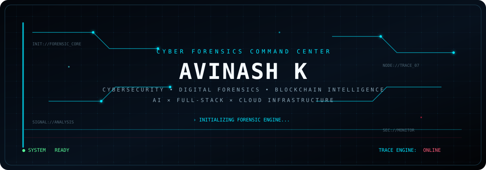
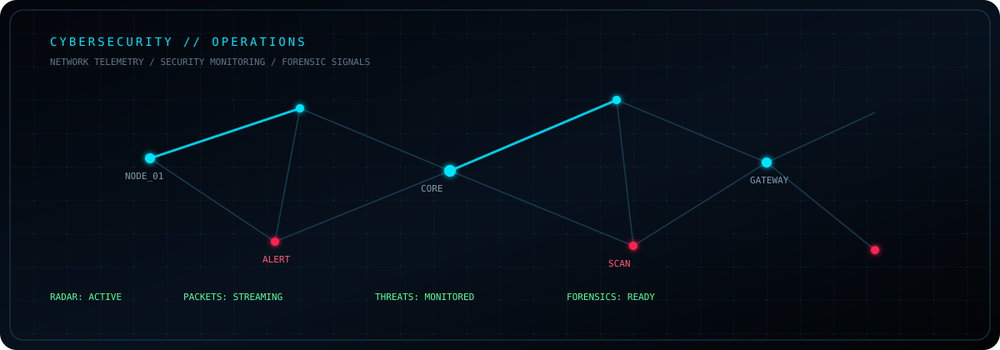
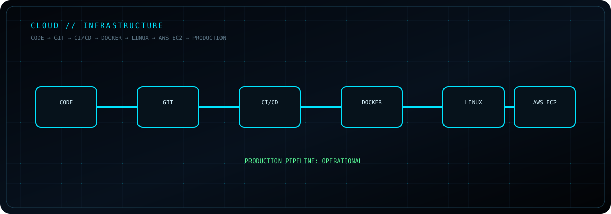
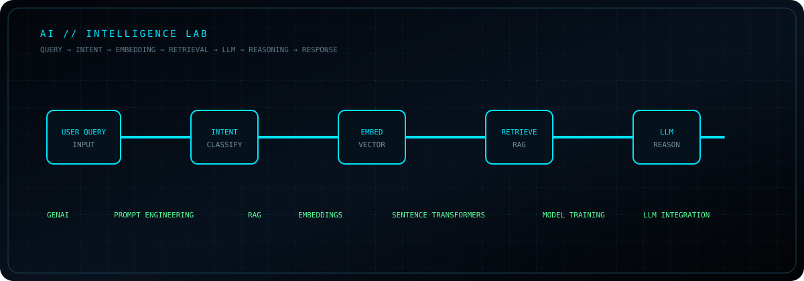
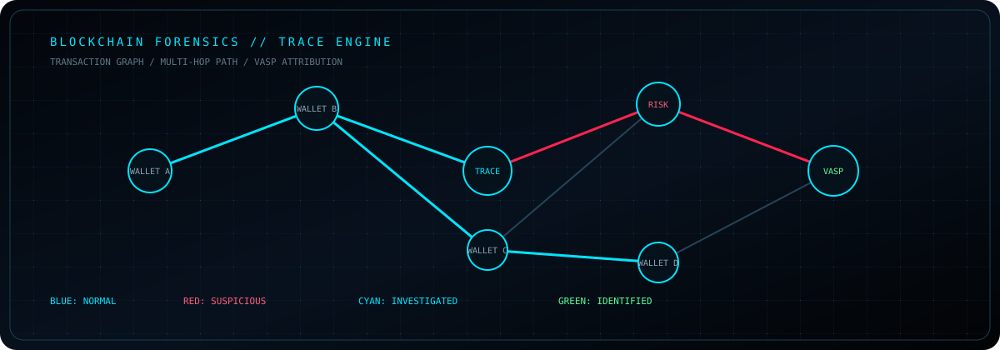
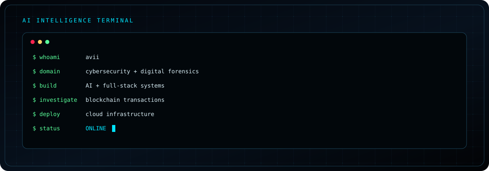

<div align="center">



<br/>


### AVINASH K
**Cybersecurity × Digital Forensics × Blockchain Intelligence × AI × Full-Stack × Cloud**

[](https://github.com/aviicroft)
[](https://www.linkedin.com/in/avinashk24/)

</div>

> B.Sc. Digital and Cyber Forensic Science student building security-focused systems at the intersection of cybersecurity, digital forensics, blockchain intelligence, AI, and full-stack engineering.


## `CYBERSECURITY // OPERATIONS`



### Security Focus
`Digital Forensics` · `Network Security` · `Vulnerability Assessment` · `Security Monitoring` · `Incident Investigation` · `OSINT` · `Linux Security` · `Web Security` · `Blockchain Forensics`

### Forensic & Security Tooling
`Kali Linux` · `Wireshark` · `Nmap` · `Burp Suite` · `FTK Imager` · `Autopsy`

---

## `FULL-STACK // ENGINEERING`



### Frontend
`Next.js` · `React` · `JavaScript` · `HTML` · `CSS` · `Tailwind CSS`

### Backend
`Python` · `FastAPI` · `Node.js` · `REST APIs` · `WebSockets` · `gRPC`

### Data
`PostgreSQL` · `MongoDB` · `MySQL` · `Redis` · `Neo4j` · `Vector Databases`


## `AI // INTELLIGENCE LAB`



`Generative AI` · `Prompt Engineering` · `LLM Integration` · `RAG` · `Embeddings` · `Sentence Transformers` · `Model Training` · `AI Application Development`

---

## `BLOCKCHAIN FORENSICS // TRACE ENGINE`



**Trace capabilities**

- Cryptocurrency tracing
- Wallet analysis
- Transaction graph analysis
- Multi-hop tracing
- Wallet attribution
- VASP attribution
- Evidence-linked investigation
- Risk analysis

**Trace stack**

`Python` · `FastAPI` · `NetworkX` · `BFS` · `Dijkstra` · `Alchemy` · `QuickNode`

---

# `FEATURED SYSTEMS`

## `TRACEVERSE`
### REAL-TIME CRYPTOCURRENCY FRAUD ATTRIBUTION

> Blockchain forensic intelligence platform designed to trace suspicious cryptocurrency fund movements, analyze wallet activity, reconstruct transaction paths, identify potential VASP connections, and support evidence-linked investigations.

**Stack:** `Python` `FastAPI` `NetworkX` `BFS / Dijkstra` `Next.js` `TypeScript` `Tailwind CSS` `Alchemy API` `QuickNode API` `PostgreSQL / MongoDB` `WebSockets`

```text
TRANSACTION
     │
     ▼
  WALLET ─────► WALLET
     │             │
     └──────► EXCHANGE / VASP
```

---

## `MEALBITE`
### SMART MEAL BOOKING & CAMPUS FOOD MANAGEMENT

> Full-stack campus food management platform supporting meal booking, QR-based meal passes, delivery tracking, feedback, notifications, food-waste monitoring, demand forecasting, analytics, reporting, and operational workflows.

**Stack:** `Next.js` `TypeScript` `Prisma` `Neon PostgreSQL` `Authentication` `Role-Based Access` `Analytics` `QR Workflows`

```text
MEAL REQUEST
     │
     ▼
  BOOKING
     │
     ▼
  QR PASS
     │
     ▼
  KITCHEN
     │
     ▼
 DELIVERY
     │
     ▼
 FEEDBACK
     │
     ▼
 ANALYTICS
```

---

## `RACAD IO`
### AI COLLEGE INFORMATION ASSISTANT

> AI-powered college information assistant using web data extraction, SentenceTransformer embeddings, FAISS retrieval, and external LLM integration.

**Stack:** `Python` `Sentence Transformers` `FAISS` `LLM APIs` `Web Scraping` `RAG`

---


## `CLOUD // INFRASTRUCTURE`

**Infrastructure:** `AWS` · `AWS EC2` · `Linux` · `Docker` · `Git` · `GitHub` · `CI/CD` · `SSH` · `DNS` · `Server Administration` · `WordPress` · `cPanel` · `Pterodactyl`


---

## `CURRENTLY BUILDING`

| Status | Focus |
|---|---|
| `● ACTIVE` | Cybersecurity Systems |
| `● ACTIVE` | Blockchain Forensics |
| `● ACTIVE` | AI-powered Security Applications |
| `● ACTIVE` | Full-Stack Applications |
| `● EXPLORING` | Advanced AI Agents |


## `GITHUB // ACTIVITY MATRIX`

<div align="center">


<br/>


</div>

> Statistics above are loaded dynamically from the configured services; no numbers are hard-coded into this README.

---

## `CONTRIBUTION // SIGNAL MAP`

<div align="center">


</div>

The repository includes a GitHub Actions workflow that generates the contribution animation automatically.

---

## `TERMINAL // SESSION`



---

## `SKILL MATRIX`

| DOMAIN | TOOLING |
|---|---|
| **CYBERSECURITY** | `Kali Linux` `Wireshark` `Nmap` `Burp Suite` `Autopsy` `FTK Imager` |
| **PROGRAMMING** | `Python` `Java` `C` `JavaScript` `Bash` |
| **FULL STACK** | `Next.js` `React` `Node.js` `FastAPI` `REST APIs` |
| **AI / GENAI** | `GenAI` `Prompt Engineering` `RAG` `Embeddings` `LLM Integration` |
| **DATABASES** | `PostgreSQL` `MongoDB` `MySQL` `Redis` `Neo4j` |
| **CLOUD** | `AWS` `EC2` `Docker` `Linux` `CI/CD` |
| **BLOCKCHAIN** | `Alchemy` `QuickNode` `NetworkX` `BFS` `Dijkstra` |


## `SYSTEM PRINCIPLES`

```text
INVESTIGATE  →  TRACE  →  ANALYZE  →  BUILD  →  AUTOMATE  →  SECURE
```

- Build security-focused software with practical forensic workflows.
- Prefer observable evidence and reproducible technical processes.
- Combine AI capabilities with conventional engineering rather than treating AI as a black box.
- Design systems that can move from prototype to deployable infrastructure.

---

<div align="center">


### BUILD. INVESTIGATE. AUTOMATE. SECURE.

**AVINASH K**  
`CYBERSECURITY × AI × FULL-STACK`


</div>
